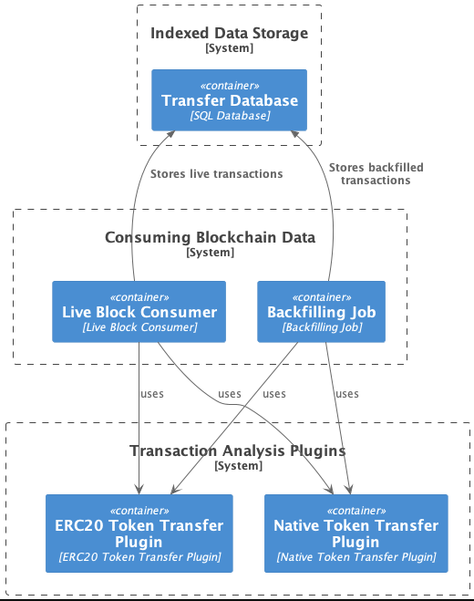

# xchain-tx-indexer-poc

Design and PoC implementation of a Blockchain indexer which can subscribe for multiple addresses transactions on different EVM compatible networks to do transaction analysis.

## Requirements

- Indexer will support N different EVM compatible networks
- Indexer will subscribe to transactions of a dynamic list of addresses
  - Addresses may get added to the dynamic list of addresses on demand (removing is out of scope)
- Indexer should be resilient to problems such as server failures, going out of sync with the chain
- Indexer should support pluggable transaction analyzers
- Indexer should support querying transaction history of multiple addresses accross different networks

## Notes

With above requirements in mind, it is trivial to build a transaction analyzer for freshly minted blocks. Considering blocks are 1 MB and will be minted every 10~ seconds, we can process this information with pluggable transaction analyers easily.

The harder part of the requirements is, how do we backfill indexed data for new addresses which are added. To solve this issue, we need to consider the complexity of backfilling, potential mitigations and need to make some assumptions.

You can find the detailed notes regarding this complexity and the assumptions in the [NOTES.md](./NOTES.md).

## High Level Design

High level design for the service can be fond at [docs/high-level-design.md](./docs/high-level-design.md)

## Proof of Concept

To demonstrate the High Level Design, a PoC has been coded with hexagonal architecture. It supports live listening to multiple blockchain networks to analyse Native Token / ERC20 transfers.

The details on what was implemented and how can be found in [docs/proof-of-concept.md](./docs/proof-of-concept.md)

## Demo
