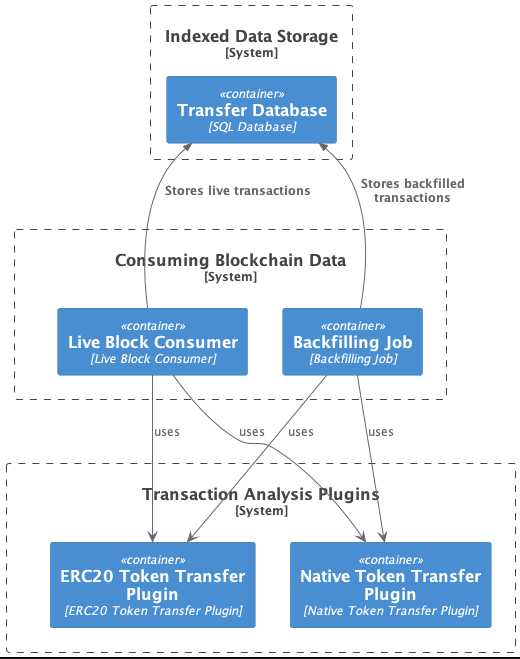

# xchain-tx-indexer-poc - High Level Design

This document contains a production ready design for the blockchain indexer defined in the [README.md](../README.md). There have been some assumptions made about the system whilst making this design, noted in [NOTES.md](../NOTES.md).

We can breakdown the high level design into 3 different modules with distinct responsibilities. This will enable separation of concerns, whilst providing a maintainable, extendible and a scaleable system.

1. **Indexed Data Storage** in what format to store the indexed data and to where.
2. **Consuming Blockchain Data** how to consume blockchain data in real-time and to back-fill missing indexed data.
3. **Transaction Analysis Plugins** what is a plugin and what kind of interface it needs to implement.



## 1. Indexed Data Storage

At the end of the day, we want to have cross-chain transactions for the addresses we are tracking for in a structured format.

We can start with thinking about how to design this database to serve our query needs. As defined in the [NOTES.md](../NOTES.md), we want to start with storing the native token and ERC20 token transfers. This indexed data should support querying for operations accross chains with multiple addresses.

Assuming we don't want to unify token addresses accross different chains. We can start with a simple table structure like:

```typescript
type Transfer = {
  // BEGIN network and transaction related data
  network: number;
  block_id: number;
  tx_idx: number;
  tx_hash: string;
  // timestamp for the transaction
  tx_ts: number;
  // BEGIN token transfer related data
  from: string; // eth address
  to: string; // eth address
  token: string; // token contract address or native token name
  amount: number; // how much was transferred
};
```

According to our query needs, we may later replicate this data in different formats to serve different queries. We may even use different databases that perform in some specific operations.

For now, assuming we will use SQL database. We can create the below indexes to make the multiple address / multiple network query faster:

- We can create two indexes on `from, network` pair and also `to, network` pair to easily do queries for some addresses accross chains. e.g. return all transactions for `{ addresses: [a, b, c], network: [x, y, z]}`
- We can create index for `tx_ts` for ordering records accross chains according to timestamp.

## 2. Consuming Blockchain Data

To feed the `Transfer` database we created in the earlier step, we need to consume blockchain data and map them to transactions.

As highlighted in the previous documents, whilst the realtime transaction analysis is a trivial task, the backfilling of the indexed data may be more complicated.

We can isolate the both problems into two separate flows to handle this complexity. Let's start by breaking down the problem into two:

1. Having a consumer which continuously listens for newer minted blocks. Let's call it `LiveBlockConsumer`.
   1. `LiveBlockConsumer` will be run for each EVM compatible network we support.
   2. Consumer will consume all necessary blockchain transactions, logs and data.
   3. Consumer will run all analysis plugins we support to extract information.
   4. Consumer will store all extracted information into some structured database (`Transfer`).
2. Creating jobs for each backfilling operation that needs to be done. Let's call these `BackfillingJob`.
   1. A `BackfillingJob` will be run with `{ network, address, plugin, fromBlock, toBlock }` parameters. Whenever we need to backfill missing information for a given address.
   2. If we want to backfill a given address, a `BackfillingJob` will be run for each plugin we have. This way, plugins may use different query mechanisms to collect missing data in an optimized way.
   3. `BackfillingJob` will run until all the blocks `fromBlock` to `toBlock` is processed and then will finish.
   4. Job will save the information it extracts with the plugin into the same database (`Transfer`) as the `LiveBlockConsumer`.

### Fault Resilience and Performance

Both `LiveBlockConsumer` and `BackfillingJob` needs to be designed in a failure resilient way. For this failure resiliency, we have multiple options.

1. `BackfillingJob` should be designed in a way that it stores its state in a database and should query data in batches.
   1. Already existing frameworks or cloud native solutions maybe used to execute Jobs in a failure resilient way.
1. `LiveBlockConsumer` can be designed in different ways to be fault tolerant:
   1. It may process blocks one by one, storing the latest block it processed in some database.
   2. It may listen to some queue for minted blocks, process each queue message. Queue would handle the fault resiliency.
   3. We may use a similar approach as a in `BackfillingJob` and think of this as a Job that never ends.

`BackfillingJob` should already be performant since it will run for each user and each plugin. Meaning we can horizontally scale the job execution.

In case `LiveBlockConsumer`, we can start with a single instance that does data consuming + processing. If it can not catch up with the new blocks. We can separate the listening of blocks / analysing them by separating the both concerns.

## 3. Transaction Analysis Plugin

As outlined in the requirements we want to separate the concern of processing transactions into a pluggable system.

The main purpose of these plugins is to convert Blockchain data into structured data we are interested in.

The plugins needs to be able to do:

1. Should be configurable to work with multiple networks
2. Given a transaction, receipt, and logs. It needs to extract structured data out of it.
3. It needs to be able to backfill missing indexed data by making performant queries

Given our `Transfer` indexing structure. We need two plugins:

### 3.1. Native Token Transfer Plugin

We need to be able to understand per network, which transactions are native token transfers. Later we need to convert these into appropiate `Transfer` models.

- **Configuration**: The network we are running on and some network related configuration maybe needed.
- **Backfill Method**: Since it is not possible to query ETH nodes to get native token transfers efficiently, we can use some third party provider for these native token transfers.

### 3.2. ERC20 Token Transfer Plugin

- **Configuration**: The network and also the token addresses we are interested in maybe provided as a configuration to this plugin. This way, we will only backfill / store tokens we are interested in and not any ERC20 token.
- **Backfill Method**: Since ERC20 contracts emit `Transfer` event with indexed from / to parameters. We can use `eth_getLogs` to query for missing data. We can also use the same third party developers as in 3.1. here. However, let's go with `eth_getLogs` to have an example of it.

## Starting `BackfillingJob` for missing data

So far, even though we talked about the `LiveBlockConsumer` and `BackfillingJob` abstractions, we have not talked about how to start `BackfillingJob`(s) when it is needed.

A good idea could be `LiveBlockConsumer` to get notified whenever there is a new address, and then creating a notification with `{ address, network, firstLiveBlockId }`. With this kind of notification, we can understand which was the first processed live block, when the address got introduced.

Later we can listen for these notifications to start backfilling jobs where `toBlock` is `firstLiveBlockId - 1`. The starting of the jobs maybe done by listeners which are specific to plugins. This way, plugins may decide to parallelize the backfilling operation.

To not miss any `BackfillingJob` creation, outbox pattern maybe used for the notifications sent by the `LiveBlockConsumer` when a new address is created.

## Monitoring and Alerting

In order to ensure the reliability and performance of the system, we need to implement proper monitoring and alerting mechanisms for both the `LiveBlockConsumer` and the `BackfillingJob`. Monitoring and alerting will allow us to identify potential issues and react to them in a timely manner, ensuring the overall health of the system.

Custom metrics can be monitored and proper alerts maybe set to ensure system is reliable and is functioning without any problems. Besides these metrics, any unexpected error during the processing of the data should create an alert.

### LiveBlockConsumer

For monitoring the `LiveBlockConsumer`, we should focus on the following metrics:

1. **Block processing time**: The time it takes to process each block, including transaction analysis and storage. Monitoring this metric will help us identify performance issues or bottlenecks in the processing pipeline.
2. **Block processing backlog**: The number of blocks waiting to be processed. A growing backlog may indicate that the `LiveBlockConsumer` is unable to keep up with the incoming data, and we may need to scale up or optimize our system.

### BackfillingJob

For monitoring the `BackfillingJob`, we should track the following metrics:

1. **Job completion time**: The time it takes to complete a backfilling job, from start to finish. This metric can help us identify bottlenecks or performance issues in the backfilling process. This metric can be broken down by plugin / network.
2. **Job backlog**: The number of backfilling jobs waiting to be executed. A growing backlog may indicate that the system is unable to keep up with the demand for backfilling, and we may need to scale up or optimize our infrastructure.
3. **API error rate**: The rate of errors encountered while interacting with blockchain nodes or other external APIs. High error rates can indicate issues with network connectivity or API stability.
